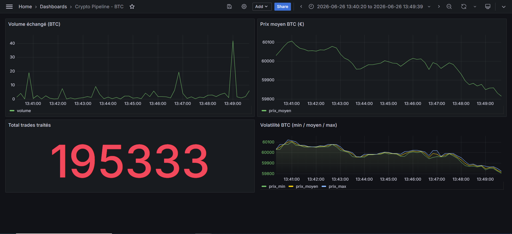

# 📊 Realtime Crypto Pipeline

> Pipeline de données **temps réel** qui capte les transactions Bitcoin en direct depuis Binance, les traite en streaming via une **architecture médaillon** (Bronze / Silver / Gold), et les visualise sur un dashboard Grafana.

**Stack :** Scala 2.13 · Apache Spark 3.5 (Structured Streaming) · Apache Kafka (KRaft) · Delta Lake · PostgreSQL · Grafana · Docker

---

## 🎯 Aperçu

Ce projet implémente une chaîne complète de data engineering, de l'ingestion temps réel jusqu'à la visualisation :

```
Binance ──▶ Kafka ──▶ Bronze ──▶ Silver ──▶ Gold ──▶ PostgreSQL ──▶ Grafana
WebSocket    bus       brut       nettoyé    agrégé     base SQL      dashboard
```

Les transactions BTC/USDT sont récupérées en direct via le **WebSocket public de Binance**, transitent par **Kafka**, puis sont raffinées en trois couches Delta Lake avant d'être exposées dans PostgreSQL et visualisées sur Grafana.

> *Dashboard temps réel : prix moyen, volume échangé, volatilité (min/moyen/max) et volume total de transactions traitées (~195 000 trades).*

---

## 🏗️ Architecture médaillon

| Couche | Rôle | Transformations |
|--------|------|-----------------|
| 🥉 **Bronze** | Ingestion brute | Lecture Kafka, parsing JSON, typage. Données stockées telles quelles (source de vérité). |
| 🥈 **Silver** | Nettoyage | Filtrage des valeurs aberrantes, **déduplication** via watermark. |
| 🥇 **Gold** | Agrégation métier | Fenêtrage temporel (10 s) : prix moyen / min / max, volume, nombre de trades. |

Chaque couche est **persistée en Delta Lake** (transactions ACID, schéma garanti) et constitue un **point de reprise** indépendant : on peut recalculer une couche sans réingérer la donnée source.

---

## 🛠️ Stack technique

- **Scala 2.13** — langage natif de Spark
- **Apache Spark 3.5.1** — Structured Streaming (fenêtrage, watermarks)
- **Apache Kafka 3.8** (mode KRaft, sans ZooKeeper) — bus de messages
- **Delta Lake 3.2** — stockage transactionnel sur les 3 couches
- **PostgreSQL 16** — base de restitution
- **Grafana 11** — dashboard
- **Docker / docker-compose** — orchestration de l'infrastructure

---

## 📁 Structure du projet

```
realtime-crypto-pipeline/
├── src/main/scala/
│   ├── producer/
│   │   └── BinanceProducer.scala      # WebSocket Binance → Kafka
│   ├── pipeline/
│   │   ├── BronzeJob.scala            # Kafka → Bronze (Delta)
│   │   ├── SilverJob.scala            # Bronze → Silver (nettoyage)
│   │   └── GoldJob.scala              # Silver → Gold (agrégation)
│   └── sink/
│       ├── GoldToPostgres.scala       # Gold → PostgreSQL (batch)
│       └── GoldStreamToPostgres.scala # Gold → PostgreSQL (streaming)
├── docker-compose.yml                 # Kafka + PostgreSQL + Grafana
├── build.sbt
└── README.md
```

---

## 🚀 Démarrage

### Prérequis
- Java 17 (Temurin recommandé)
- sbt
- Docker Desktop

### 1. Lancer l'infrastructure
```bash
docker compose up -d
```
Démarre Kafka, PostgreSQL et Grafana.

### 2. Lancer le pipeline
Exécuter les jobs Spark dans cet ordre (depuis l'IDE ou via sbt) :
```
1. producer.BinanceProducer     # alimente Kafka en trades live
2. pipeline.BronzeJob           # Kafka → Bronze
3. pipeline.SilverJob           # Bronze → Silver
4. pipeline.GoldJob             # Silver → Gold
5. sink.GoldStreamToPostgres    # Gold → PostgreSQL
```

### 3. Visualiser
- **Grafana** : [http://localhost:3000](http://localhost:3000) (admin / admin)
- Source de données : PostgreSQL (`postgres:5432`, base `crypto`)

---

## 💡 Points techniques notables

- **Batch & streaming unifiés** : la même logique d'agrégation tourne en batch (validation) ou en streaming (production), illustrant la flexibilité de Spark.
- **Watermarking** : bornage de l'état pour la déduplication et le fenêtrage, évitant une croissance mémoire infinie sur un flux continu.
- **`foreachBatch`** : pont entre streaming et JDBC pour écrire dans PostgreSQL (Spark n'ayant pas de sink JDBC streaming natif).
- **Découplage** : Kafka comme tampon durable → résilience et rejouabilité du pipeline.

---

## 🔮 Améliorations possibles

- Contrôles qualité automatisés (Deequ / Great Expectations)
- Déploiement sur cluster (YARN / Kubernetes) au lieu du mode local
- Gestion des secrets hors du code
- CI/CD via GitHub Actions
- Support multi-cryptos (le schéma est déjà prêt)

---

## 👤 Auteur

**Idriss Amrani** — Data Engineer / Analyst

---

*Projet réalisé dans le cadre d'une montée en compétence sur l'écosystème Scala / Spark / streaming temps réel.*